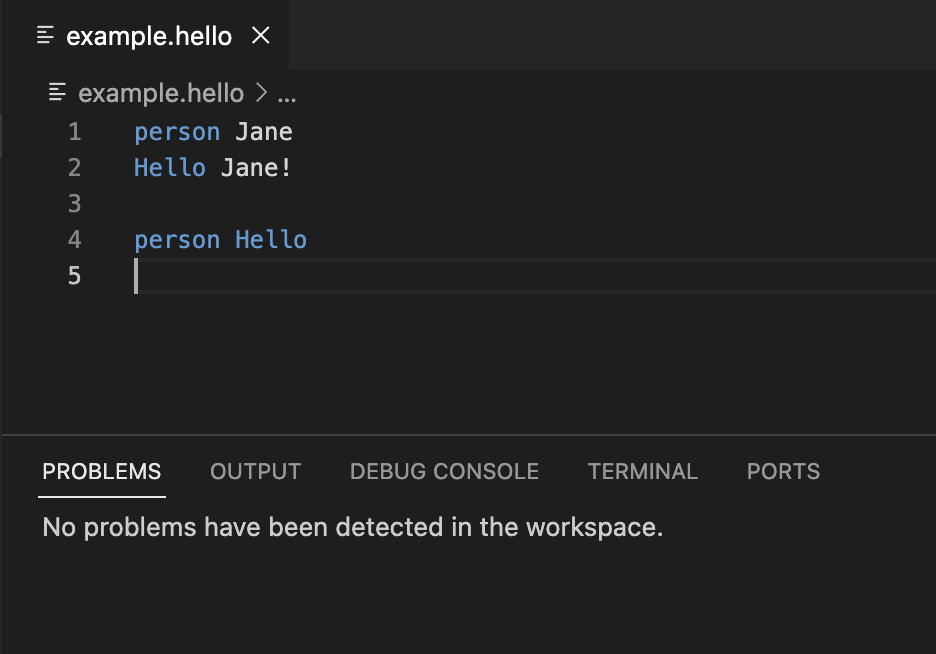
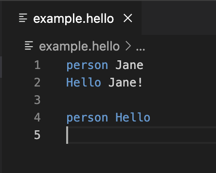

When your language uses keywords, which is the usual case, e.g. `var`, `const` or `function` keywords in programming languages, all occurrances of these strings are treated by Langium as keyword tokens by default, even at places which are not intended by the rules in the Langium grammar.
Additionally, these strings are marked like keywords (in blue in this guide, while other text is white) whenever they are used.
Summarizing, these keywords cannot be used as values for names, identifiers or other properties by default and need to be explicitly enabled.
This guide explains, how to do that.

To keep this guide short, let's look at the "hello-world" example, in the [playground](https://langium.org/playground?grammar=OYJwhgthYgBAEgUwDbIPYHU0mQEwFD6IB2ALiAJ6wCyauKAXPrC7ABQAOiIAzmsTwDUAXgAK3PsVgAfWKESJSAS2LAhwgOIgFy1QEoAVAG5C43vyatYAci7ni12MUiJhASQAiJ-Fp0rglqzWSKhojnaSwgDaZpIMngC6NgCE1t4AFkq49FKk3BAqYMiwGADKDLAA9AA6QpUmeSAFzsWeFZVRAPpgALQAXgCCPQBaCVHVAO6dCQb1hJnZJLCNzUU0ADKdAMIA8tTUAKIAcgAq7dU1BuM81aUzAPzVBhdzCznL%2BYXFpZu7%2B8dnKoXC5RAB61WI1RAMzmQA&content=A4UwTgzg9gdgBAKQIYxAKABIgDbaolEAQjTVElji1yjSA) or as a new local project created with `yo langium` (for details, how to set up your first Langium project, read [getting started](/docs/getting-started/)):


Here, it is not possible to introduce a person whose name is "Hello", since `Hello` is a dedicated keyword of the language. Additionally, we cannot greet a person called "Hello" as well.
The same counts for the keyword "person", but in this guide, we focus on enabling "Hello" as name for persons. After reading this guide, you will be able to add support for "person" as name by your own.

To enable keywords as identifiers, you need to apply the following three steps:

1. Tweak the grammar to explicitly parse keywords as property values.
2. Change the semantic type of the resulting token.
3. Ensure, that your editor supports styles for the chosen semantic type.


The __first step__ is to tweak the grammar to explicitly parse keywords as property values:
At the moment, the parser rule for introducing persons looks like this:

```langium
Person: 'person' name=ID;
terminal ID: /[_a-zA-Z][\w_]*/;
```

Note, that the terminal rule for `ID` already covers the string "Hello",
but since the parser rule for greeting persons uses "Hello" as keyword, the keyword wins:

```langium
Greeting: 'Hello' person=[Person:ID] '!';
```

Roughly summarized, the background for this behaviour is, that Langium internally use [Chevrotain](https://chevrotain.io) for tokenizing, i.e. splitting text into single tokens, e.g. words separated by white space.
Chevrotain uses regex for splitting text into tokens.
Since keywords are realized as regex as well, *all* occurrances of "Hello" are treated as keywords for the parser rule for greetings,
even "Hello" which are intented to be names, which causes the parsing problems (see the two errors in the "Problems" tab above).

In order to explicitly enable parsing "Hello" as name as well, tweak the parser rule for persons in this way:

```langium
Person: 'person' name=(ID | 'Hello');
terminal ID: /[_a-zA-Z][\w_]*/; // the terminal rule for ID is unchanged!
```

Now Langium knows, that "Hello" not always indicates the keyword of the greeting parser rule, but can also occur as explicit value for the `name` property of the parser rule for persons.
That's it! (Don't forget to run `npm run langium:generate` after updating the grammar.)



Since the `name` property is used for cross-references by the parser rule for greetings, "Hello" needs to be supported here as well. For that, we recommend to introduce a [data type rule](/docs/grammar-language/#data-type-rules) like "PersonID" in the example, since it makes it easier to support more keywords in the future:

```langium
Person: 'person' name=PersonID;

Greeting: 'Hello' person=[Person:PersonID] '!';

PersonID returns string: ID | 'Hello';
```


As you can see, Langium accepts "Hello" as value for person's names now.
Nevertheless, the name "Hello" still is marked in blue and looks like a keyword "Hello". This leads us to the second step.


The __second step__ is to change the semantic type of the resulting token in order to adjust the highlighting in the editor:
While parsing text with Langium is done in a language server, the highlighting is done in editors (the language clients).
Editors like VS Code usually use *syntax highlighting* basing on the tokenized text. This highlighting can be complemented by *semantic highlighting* with additional semantic information for the tokens from the language server.

In case of Langium and VS Code, VS Code uses by default TextMate grammars, which can be seen as collections of regex (and which is generated by `npm run langium:generate`), to split the text into tokens and assigns a (syntactic) type to these tokens. The color for highlighting the token is chosen depending on the assigned type.
In the example, a regex for the "Hello" keyword matches *all* strings "Hello" in text, resulting in the blue color even for "Hello" used as name.

In contrast to this, Langium is able to distinguish "Hello" keywords and "Hello" names and therefore is able to assign different *semantic* types to "Hello" tokens.
According to the Language Server Protocol (LSP), these semantic token types are sent to editors like VS Code, which complement the syntactic types of tokens with these semantic types.
Color themes are able adjust the default highlighting of tokens, which depends on the syntactic type, according to the semantic token type now.

In Langium, the `SemanticTokenProvider` service is responsible for assigning language-dependent semantic types to tokens.
Therefore, we customize the default semantic token provider like this:

```ts
import { AbstractSemanticTokenProvider, AstNode, SemanticTokenAcceptor } from "langium";
import { isPerson } from "./generated/ast.js";
import { SemanticTokenTypes } from 'vscode-languageserver';

export class HelloWorldSemanticTokenProvider extends AbstractSemanticTokenProvider {
    protected override highlightElement(node: AstNode, acceptor: SemanticTokenAcceptor): void | "prune" | undefined {
        if (isPerson(node)) {
            acceptor({
                node,
                property: 'name',
                type: SemanticTokenTypes.class
            });
        }
    }
}
```

For all persons (`isPerson(...)` in line 7), we explicitly specify the semantic type for the token of their `'name'` property.
Here, we use `SemanticTokenTypes.class` as semantic type.
For your case, select a predefined type which fits your domain best.
Since the name is used as cross-reference by greetings, a similar check and assignment of a semantic token type needs to be done for the `person` property of `Greeting` as well.

After creating the semantic token provider, you need to register the `HelloWorldSemanticTokenProvider` in `hello-world-module.ts` in the following way:

```ts
export const HelloWorldModule: Module<HelloWorldServices, PartialLangiumServices & HelloWorldAddedServices> = {
    lsp: {
        SemanticTokenProvider: (services) => new HelloWorldSemanticTokenProvider(services)
    },
    validation: {
        HelloWorldValidator: () => new HelloWorldValidator()
    }
};
```

Now rebuild and restart your application and test the improvements of the second step:



The `HelloWorldSemanticTokenProvider` works, and you might see a different highlighting XOR you might not see any difference, e.g. "Hello" is still blue here. This leads us to the third step.

The __third step__ is to ensure, that your editor supports the assigned semantic tokens:
Depending on your editor and the currently selected color theme, the semantic token type selected in `HelloWorldSemanticTokenProvider` might not be supported or didn't got a different color in the color theme.
The easiest way to detect such problems is to change the current color theme and to try some others.
Note, that VS Code allows to switch off semantic highlighting for all themes with the setting `editor.semanticHighlighting.enabled`.

After switching from "Dark (Visual Studio)" to "Dark Modern" in VS Code, the example looks as expected.
You can switch the current color theme in VS Code with `cmd + K` `cmd + T` (or via the menu: Code -> Settings... -> Theme -> Color Theme).


Now "Hello" is marked in purple, when it is used as keyword, and in green, when it is used as value for the name of a person.
Another solution is to select a different semantic type for your token in step two.
A more elaborate solution is to create your own color theme and to ship it with your VS Code extension of your language.

While __step one__ is mandatory to enable keywords as values in general,
__step two__ improves the user experience of your language.
While step one and step two can be handled in the LSP server once for your language, __step three__ highly depends on your editor and its color themes (in the LSP clients), which makes step three quite complicated to handle.


Now you know, how to technically enable keywords as regular values for properties.
As home work, it is your task to enable the keyword "person" as name for persons in the example.
Whether it makes sense to support keywords as values in your language at all is up to you to discuss with the users of your language!


Some hints beyond this guide:

- In [multi-grammar projects](/guides/multiple-languages.md), only keywords of the included grammars are affected by this general problem, but not keywords of other languages or Langium grammar files.
- Read about the concept of semantic tokens in the [Language Server Protocol](https://microsoft.github.io/language-server-protocol/specifications/lsp/3.17/specification/#textDocument_semanticTokens) (LSP) including predefined semantic types for tokens.
- Read, how [VS Code](https://code.visualstudio.com/api/language-extensions/semantic-highlight-guide) realizes semantic highlighting using semantic tokens.
- Dive into [tokenizing of Chevrotain](https://chevrotain.io/docs/features/token_alternative_matches.html) with regex.
